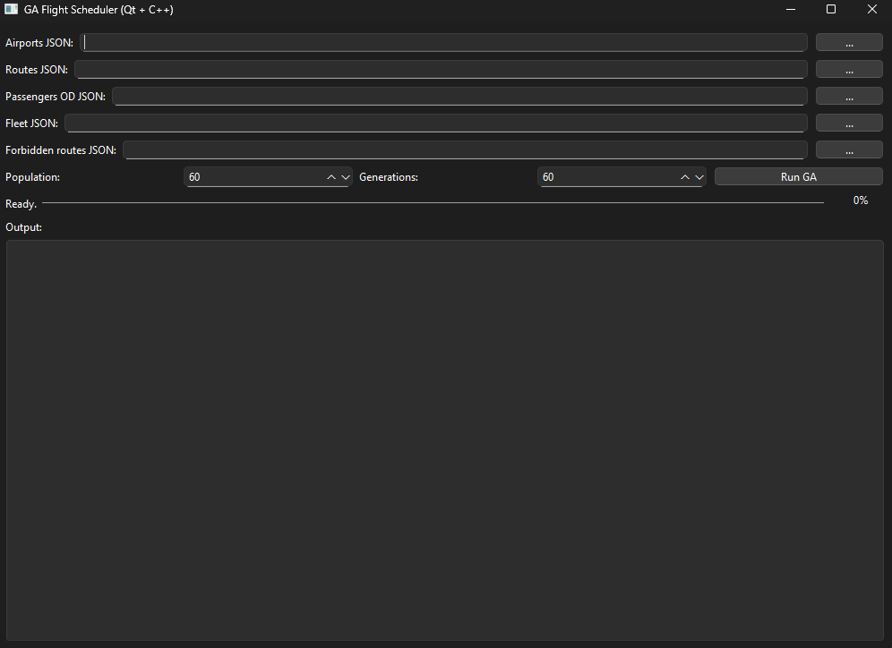

## GA Flight Scheduler – Planejamento de Rotas Aéreas (Local)

Aplicação para planejamento de malha aérea brasileira usando **algoritmo genético (GA)** em C++/Qt, com notebooks em Python para **gerar dados**, **analisar resultados** e **montar relatório em PDF**.



---

## Estrutura do repositório

- **build/**
  - `AeroportosGA.exe` – programa principal em Qt (interface gráfica + GA).
  - `*.dll`, `platforms/`, `styles/` – bibliotecas e plugins necessários para rodar o executável.
- **jsons/**
  - Arquivos JSON de entrada padrão do problema:
  - `airports.json` – definição dos 14 aeroportos.
  - `routes.json` – todas as rotas possíveis (a partir da TAB_TV).
  - `passengers.json` – demanda OD agregada.
  - `fleet.json` – frota de 250 aeronaves.
  - `forbidden_routes.json` – exemplo de arquivo com rotas proibidas.
- **airnet_inputs/**
  - Pasta de trabalho principal dos experimentos.
  - Contém um **exemplo completo** de simulação (JSONs de entrada + saída do GA):
    - `airports.json`, `routes.json`, `passengers.json`, `fleet.json`
    - `flights_ga.json` – voos da melhor solução do GA.
    - `passengers_flights.json` – alocação de passageiros por voo.
    - `ga_stats.json` – evolução do GA (scores, passageiros, tempos, etc.).
    - `TAB_AV_voos.csv`, `TAB_AP_passageiros_grupos.csv`
    - `tab_tv.csv`, `tab_od.csv`
    - `Brazil_Blank_Map.svg`, `Brazil_states_blank.png`
    - `relatorio_trafego_aereo.pdf` – exemplo de relatório gerado pelo notebook.
- **notebooks/**
  - `Data Builder.ipynb` – gera os JSONs base a partir das tabelas do enunciado.
  - `Analyser.ipynb` – lê os JSONs de saída do GA, gera gráficos e o PDF do relatório.
- **projeto_cpp/**
  - Código-fonte em C++/Qt do programa (`AeroportosGA.exe`).
- **images/**
  - `ui.png` – captura de tela da interface principal.

O arquivo **`README.md` (este)** é a versão atualizada com foco em **uso local**.

---

## Requisitos

- **Sistema operacional**: Windows 10 ou superior (testado).
- **Para rodar o executável Qt**:
  - Não é necessário ter Qt instalado; basta usar o conteúdo da pasta `build/`.
- **Para rodar os notebooks em Python localmente**:
  - Python **3.8+** instalado.
  - Pacotes Python:
    - `notebook`
    - `numpy`
    - `pandas`
    - `matplotlib`

Instalação rápida dos pacotes (após instalar o Python e o `pip` estar no PATH):

```powershell
pip install notebook numpy pandas matplotlib
```

---

## 1. Rodando o programa Qt (GA) localmente

1. Abra o Explorer e navegue até a pasta do projeto:
   - `C:\Users\lucas\Projects\Softwares\PSI3472`
2. Entre na pasta `build/`.
3. Dê **duplo clique** em `AeroportosGA.exe`.

Na interface, você verá os campos:

- `Airports JSON`
- `Routes JSON`
- `Passengers OD JSON`
- `Fleet JSON`
- `Forbidden routes JSON` (opcional)
- Parâmetros:
  - `Population`
  - `Generations`
  - Botão **Run GA**

### 1.1. Carregando os arquivos de entrada

Você pode usar:

- Os JSONs padrão em `jsons/`, **ou**
- Os JSONs gerados pelo notebook `Data Builder.ipynb` em `airnet_inputs/`.

Ordem típica:

1. `Airports JSON` → `jsons/airports.json` ou `airnet_inputs/airports.json`
2. `Routes JSON` → `jsons/routes.json` ou `airnet_inputs/routes.json`
3. `Passengers OD JSON` → `jsons/passengers.json` ou `airnet_inputs/passengers.json`
4. `Fleet JSON` → `jsons/fleet.json` ou `airnet_inputs/fleet.json`
5. (Opcional) `Forbidden routes JSON` → `jsons/forbidden_routes.json` ou `airnet_inputs/forbidden_routes.json`

### 1.2. Configurando o GA e executando

1. Ajuste:
   - **Population** – tamanho da população do GA (por exemplo, `60`).
   - **Generations** – número de gerações (por exemplo, `60`).
2. Clique em **Run GA**.
3. A barra de progresso e a área de **Output** vão mostrar o andamento da execução.
4. Ao final, o programa grava arquivos de saída, tipicamente em `airnet_inputs/`:
   - `flights_ga.json`
   - `passengers_flights.json`
   - `ga_stats.json`

Esses arquivos serão usados depois pelos notebooks de análise.

---

## 2. Rodando os notebooks Python localmente

Os notebooks já foram ajustados para usar **caminhos relativos**:

- Eles procuram uma pasta chamada `airnet_inputs`:
  - Primeiro na pasta atual do notebook.
  - Depois na pasta-mãe do notebook.
- No layout deste repositório, isso cai corretamente em:
  - `C:\Users\lucas\Projects\Softwares\PSI3472\airnet_inputs`

### 2.1. Iniciar o Jupyter Notebook

1. Abra o **PowerShell**.
2. Vá até a pasta raiz do projeto:

   ```powershell
   cd C:\Users\lucas\Projects\Softwares\PSI3472
   ```

3. Inicie o Jupyter:

   ```powershell
   jupyter notebook
   ```

   > Se aparecer erro dizendo que `jupyter` não é reconhecido, instale com:
   >
   > ```powershell
   > pip install notebook
   > ```
   >
   > e depois rode `jupyter notebook` novamente.

4. O navegador será aberto mostrando a estrutura de pastas do projeto.

---

## 3. Gerando os dados base com `Data Builder.ipynb` (opcional)

Use este notebook se quiser **reconstruir do zero** os arquivos JSON/CSV a partir das tabelas do enunciado (TAB_TV, TAB_OD).

Passo a passo:

1. No Jupyter, entre em `notebooks/` e abra `Data Builder.ipynb`.
2. (Opcional) Ajuste as tabelas do enunciado (TAB_TV, TAB_OD) se quiser testar outros cenários.
3. Rode todas as células:
   - Menu: **Kernel → Restart & Run All** (ou `Run All`).
4. A primeira célula imprime algo como:

   ```text
   Arquivos vão ser salvos em: C:\Users\lucas\Projects\Softwares\PSI3472\airnet_inputs
   ```

5. Ao final, serão gerados (em `airnet_inputs/`):
   - `airports.json`, `airports.csv`
   - `routes.json`, `routes.csv`, `tab_tv.csv`
   - `passengers.json`, `tab_od.csv`
   - `fleet.json`
   - `meta.json`

Esses arquivos podem ser usados diretamente pelo executável Qt.

---

## 4. Analisando os resultados do GA com `Analyser.ipynb`

Depois de rodar o GA e ter os arquivos de saída (`flights_ga.json`, `passengers_flights.json`, `ga_stats.json`) em `airnet_inputs/`, você pode gerar gráficos e relatório em PDF.

Passo a passo:

1. No Jupyter, abra `notebooks/Analyser.ipynb`.
2. Rode todas as células:
   - **Kernel → Restart & Run All**.
3. O notebook:
   - Lê os arquivos em `airnet_inputs/`.
   - Constrói:
     - Plano diário de voos (Gantt, por aeronave).
     - Distribuição de fatores de carga (occupancy).
     - Distribuição de tempos de viagem por grupo de passageiros.
     - Matriz OD efetivamente atendida.
     - Evolução do GA (score, passageiros servidos, tempo por geração, etc.).
     - Mapas dos aeroportos e das conexões (incluindo rotas proibidas, se houver).
   - Gera e salva o PDF:
     - `relatorio_trafego_aereo.pdf` dentro de `airnet_inputs/`.

Você pode abrir esse PDF com qualquer leitor (Edge, Adobe Reader, etc.) para ter um relatório completo da simulação.

---

## 5. Rotas proibidas (`forbidden_routes.json`)

O arquivo de rotas proibidas permite bloquear pares Origem–Destino específicos, para testar cenários mais realistas ou limitar a malha.

Formatos aceitos:

1. **Por código de aeroporto**:

```json
{
  "forbidden_routes": [
    { "orig_code": "SP", "dest_code": "RJ" },
    { "orig_code": "RJ", "dest_code": "SP" },
    { "orig_code": "SP", "dest_code": "BR" },
    { "orig_code": "BR", "dest_code": "SP" }
  ]
}
```

2. **Por ID numérico (0 a 13 na ordem MA, BE, FO, NA, RE, SA, BR, BH, CI, RJ, SP, CR, FL, PA)**:

```json
{
  "forbidden_routes": [
    { "orig_id": 10, "dest_id": 9 },
    { "orig_id": 9,  "dest_id": 10 },
    { "orig_id": 10, "dest_id": 6 },
    { "orig_id": 6,  "dest_id": 10 }
  ]
}
```

> Observação: se quiser proibir **ida e volta**, lembre-se de colocar ambas as direções.

Coloque esse arquivo em `airnet_inputs/` (ou `jsons/`) e selecione-o no campo **Forbidden routes JSON** da interface Qt.

---

## 6. Fluxo completo sugerido

1. **(Opcional)** Rodar `Data Builder.ipynb` para gerar ou atualizar os JSONs base em `airnet_inputs/`.
2. **Rodar o GA**:
   - Abrir `build/AeroportosGA.exe`.
   - Selecionar os JSONs de entrada (de `airnet_inputs/` ou `jsons/`).
   - Ajustar `Population` e `Generations`.
   - Clicar em **Run GA** e aguardar.
3. **Conferir os arquivos de saída** em `airnet_inputs/`:
   - `flights_ga.json`, `passengers_flights.json`, `ga_stats.json`, etc.
4. **Rodar `Analyser.ipynb`**:
   - Gerar gráficos e o relatório `relatorio_trafego_aereo.pdf`.
5. **Repetir** o processo com diferentes parâmetros do GA ou diferentes arquivos de entrada (incluindo rotas proibidas) para comparar cenários.
